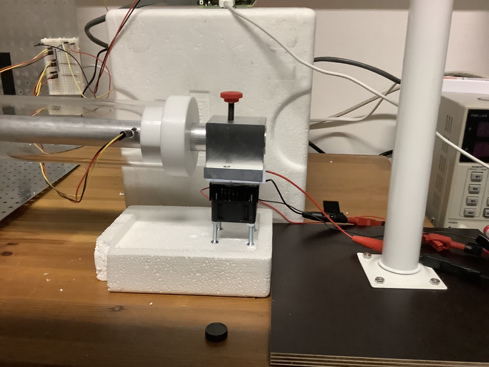

## Tutorial - Operating the thermal gradient apparatus

### 1) Start the gradient apparatus
- Fire up the gradient apparatus by connecting the peltiers to the power supplies and switch on the devices. Importantly, don't put excessive Voltage (never exceed 5-10V) and be aware that electricity can be dangerous, thus handle with care, e.g. DO NOT drop the Peltier in the water as this will cause a short circuit!!


- The side of Peltier element with a label is the one that is cooling and the other one is heating. Thus, check before-hands if the Peltier is correctly oriented for your purpose on each heat block. You need to fill the bucket with ice and place the heat block in there at the side where you want to cool because the "Abwärme" is otherwise too strong and will eventually result in a loss of cooling capacity.
- Cooling:

- Heating:


- I found that a setting of 4V and 2.5A on the hot (left) side and 3.5V and 2.5A on the cold (right) side, yields a good gradient at room temperature (from app. 11° - 30°C)

- Make sure to put a strip of wet filterpaper between the metal plate and the arena to avoid dessication of the flies

- Seal the ends of the arena (after the top openings) with cotton stoppers and put the temperature sensors in the correct order: 0 at the cold end; 1 to the middle and 2 at the hot end. 

### 2) Set up Raspberry pi to collect data.
- On the Raspberry Pi, double click on the Python-script TempPixGradient.py on the Desktop, which then opens up in Thorny. Then click on "Run". 

- A new window will open. At first, set an output directory. I would just add a folder to the path `/home/pi/Pictures`, which is already written in the window. Note, that the path may NOT contain any spaces!! For example put: `/home/pi/Pictures/test_210527`

- Then, you can adjust the intervals of temperature measurements and image taking in the corresponding windows in seconds. Finally, you can optionally set the desired temperature interval. The colours of the temperatures at the sensors will then indicate how close you are to these, I.e. if the temp is too cold, the color will become blue, if it is close to the desired temp, it will be green and if it is too hot, it will become red.

- If everything is set press "Measure Temperature" to start the temperature measurements. The line plot  at the bottom will show the development of the thermal gradient over time. I would then let the gradient equilibrate for 30min before starting the experiments. The experiment can start once the temperatures do not change a lot anymore.

### 3) Add flies for thermal preference measurment
- Before adding the flies, make sure that there are NO large spaces between the aluminum plate and the plexiglass arena so that no flies can slip underneath

- Then add the flies with an aspirator in the central holes of the two arenas. Then either close with a glass microscope slide or put a cotton stopper. 

- Once everything is set, press "Take Pictures" in the program and switch off the light. Images will be taken at the given intervals until the experiment is finished by you. I would let it run for app. 30min so that the flies have time to settle in their desired thermal area.

#### 4) Analyze the images taken from the experiment
- Copy over all images from the output folder onto a USB stick and transfer it to your computer. There you need to have Fiji installed (https://imagej.net/Fiji) in order to measure the coordinates of the thermal sensors and the flies.

- Pick the image that you want to use for quantification. Then, choose the multipoint tool and pick the coordinates of the stoppers (sensors 0+2) at the end of the gradient and the central opening (sensor 1).

- Do the measurements by typing Command+M and copy all the the coordinates (Command+A and the Command+C) to Excel. You only need to retain the last two columns (X and Y, respectively). Then, I would use the table with temperature measurements that is automatically stored on the RasPi to take notes of the corresponding temperatures 

- After that, clear the measurements from the Results box and from the image (by selecting all Command+A) and start measuring each fly

- When you are done, do the actual measurements as above and copy the values to Excel. There, you need to make a list of the X and Y coordinates and store it as a tab-delimited file with a header-line containing X and Y. X any Y need to be the first columns, but you can add any additional columns with meta-information after that.

- Install Python 3 from here: https://www.python.org/downloads/.In addition, install the packages numpy scipy and matplotlib with pip3. Copy and execute the following command in Terminal: 

```bash
pip3 install numpy scipy matplotlib
```

- Then, build the command line for the Python script `analyzeTemp.py`, which can be found in the scripts folder:

```bash
python3 scripts/analyzeTemp.py \
--low <X>,<Y>,<Temp> \
--mid <X>,<Y>,<Temp> \
--high <X>,<Y>,<Temp> \
--input <PathTo>/InputTable.txt \
--output <PathTo>/Output
```

- Replace \<PathTo\> with the full directory path to the script analyzeTemp.py, the input file and the output. Replace \<X\>,\<Y\> and \<Temp\> with the values of the X and Y coordinates and the measured temperatures at Sensor0 (low), Sensor1 (mid) and Sensor(2). "InputTable" is the tab-delimited file for the fly coordinates "Output" is a prefix for the name of the output table and an output figure. The Tp is calculated based on the coordinates according to this:


 
### 5) Test dataset
- to test the workflow on a test dataset, execute the CommandlineExample in TestData

