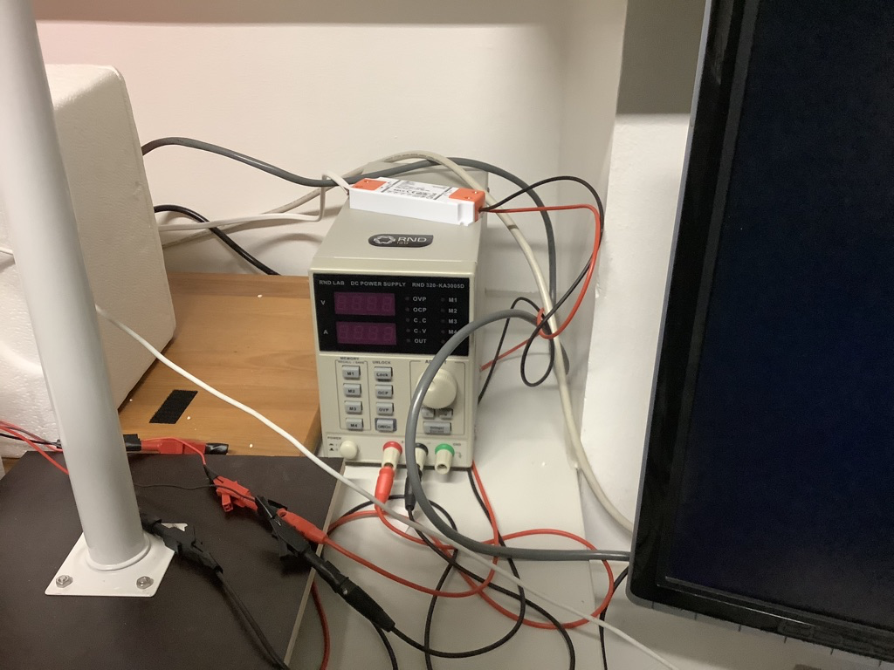
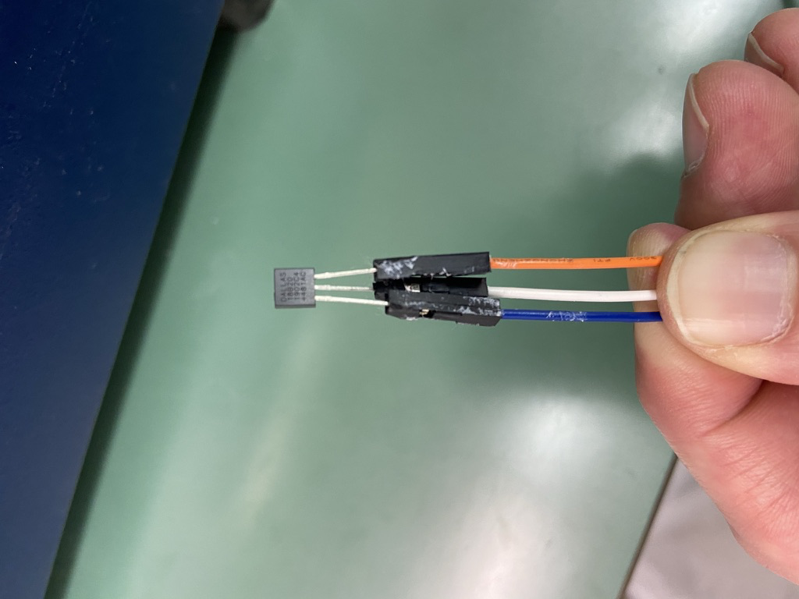

## Components

(sorry for being available in german only)

- [Yageo CFR-25JT-52-4K7 Kohleschicht-Widerstand 4.7 kΩ axial bedrahtet 0207 0.25 W 5 % 1 St. ](https://www.conrad.ch/de/p/yageo-cfr-25jt-52-4k7-kohleschicht-widerstand-4-7-k-axial-bedrahtet-0207-0-25-w-5-1-st-1417695.html)

- [Joy-it Baseboard mit Analogconverter, 12*XH254](https://www.conrad.ch/de/p/joy-it-baseboard-mit-analogconverter-12-xh254-raspberry-pi-erweiterungs-platine-1267835.html)

- [Joy-it IR-Pro 5MP IR CUT CMOS Farb-Kameramodul Passend für: Raspberry Pi IR-Zusatzlicht ](https://www.conrad.ch/de/p/joy-it-baseboard-mit-analogconverter-12-xh254-raspberry-pi-erweiterungs-platine-1267835.html)

- [Joy-it rb-camera-0.75 Kamera-Kabel Raspberry Pi [1x CSI - 1x CSI] 0.75 m Weiß ](https://www.conrad.ch/de/p/joy-it-rb-camera-0-75-kamera-kabel-raspberry-pi-1x-csi-1x-csi-0-75-m-weiss-1283499.html)

- [TRU COMPONENTS 0165-40-4-28010 Steckplatine Bus-Stripe ausklappbar Polzahl Gesamt 400 (L x B x H) 86.5 x 64.5 x 8.5](https://www.conrad.ch/de/p/tru-components-0165-40-4-28010-steckplatine-bus-stripe-ausklappbar-polzahl-gesamt-400-l-x-b-x-h-86-5-x-64-5-x-8-5-mm-1564793.html)

- [TRU COMPONENTS EIC-J-L Steckbrücken-Set (L x B x H) 168 x 55.5 x 14.5 mm 140 St. ](https://www.conrad.ch/de/p/tru-components-eic-j-l-steckbruecken-set-l-x-b-x-h-168-x-55-5-x-14-5-mm-140-st-1566205.html)

- [Vogt Verbindungstechnik 1364C.68 Steckerstift Kontaktoberfläche verzinnt 100 St. ](https://www.conrad.ch/de/p/vogt-verbindungstechnik-1364c-68-steckerstift-kontaktoberflaeche-verzinnt-100-st-526191.html)

- [TRU COMPONENTS 98001c421 Steckbrücken-Set Bunt Polzahl Gesamt 1 75 Teile ](https://www.conrad.ch/de/p/tru-components-98001c421-steckbruecken-set-bunt-polzahl-gesamt-1-75-teile-1662102.html)

- [Maxim Integrated DS18B20+ Linear IC - Temperatursensor, Wandler Digital, zentral 1-Wire® TO-92-3 ](https://www.conrad.ch/de/p/maxim-integrated-ds18b20-linear-ic-temperatursensor-wandler-digital-zentral-1-wire-to-92-3-1123323.html)

- [RND 320-KD3005D - Labornetzgerät, 30V, 5A, 150W, Einstellbar, CEE 7/7, RND Lab](https://www.distrelec.at/de/labornetzgeraet-30v-5a-150w-einstellbar-cee-rnd-lab-rnd-320-kd3005d/p/30061866)

## Wiring setup

#### Wiring of powersupply and Peltier elements 

#### Wiring on Raspberry Pi with Joy-It Baseboard 

#### Wiring on Breadboard

#### Wiring on DS18B20+ TempSensor 

#### Complete Setup

